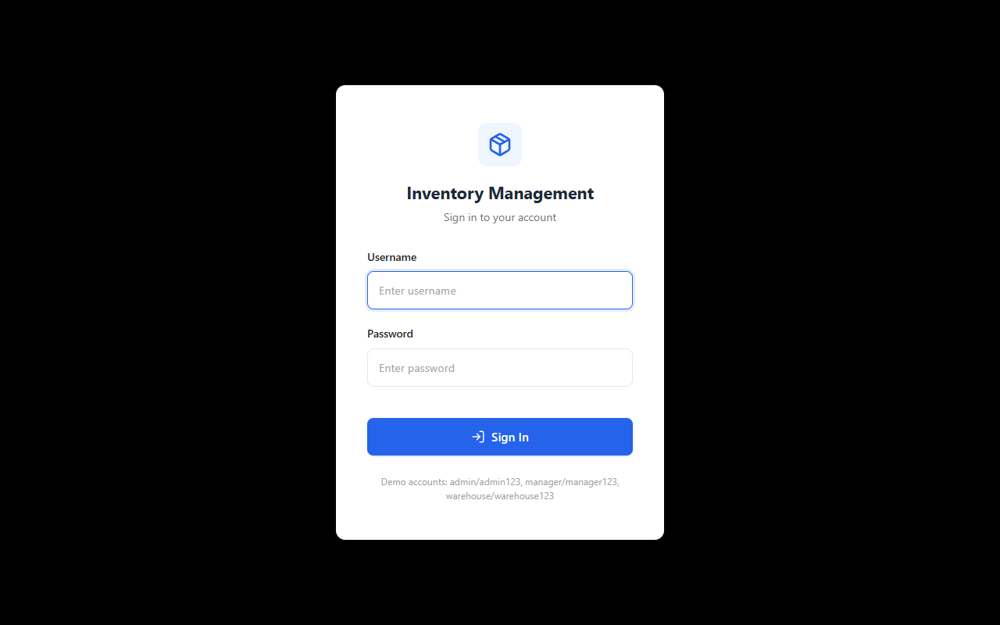
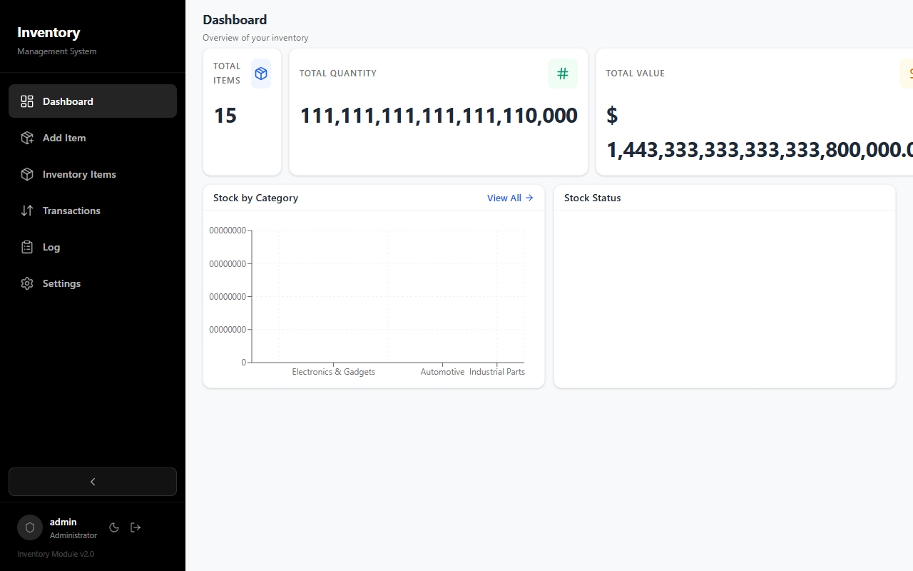
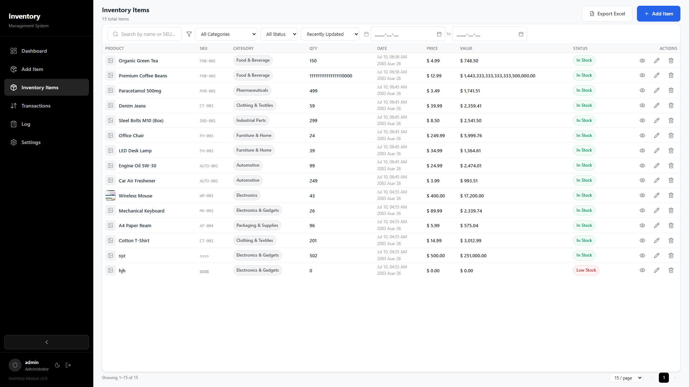
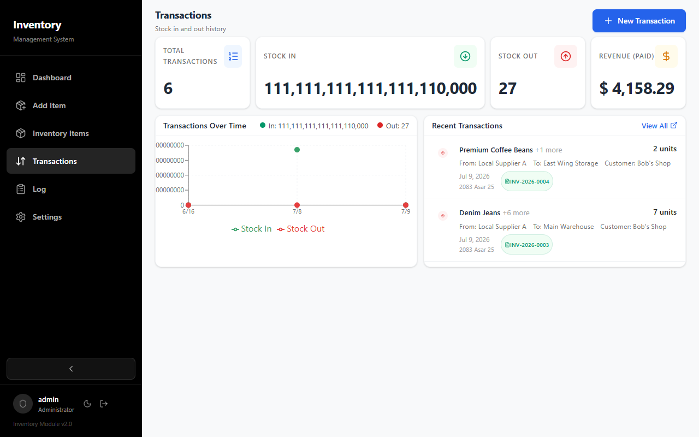
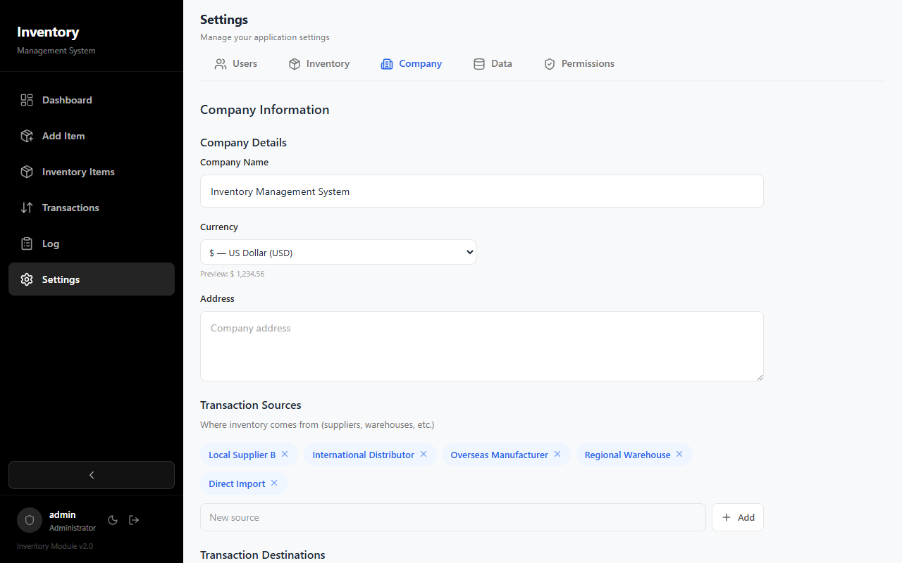

# Inventory Management System

A full-stack inventory management application with dashboard, transaction logging, invoicing & billing, batch tracking, activity audit trail, multi-currency support, QR/barcode generation, role-based access control, and CSV/Excel export capabilities.

Built with **Node.js + Express** on the backend, **React + Vite** on the frontend, and **SQLite** for data storage.

## Screenshots

| | |
|---|---|
|  |  |
|  |  |
|  | |

## Features

### 📊 Dashboard
- Real-time overview with stock statistics
- Stock by category bar chart and stock status pie chart (powered by Recharts)
- Recent transaction feed
- Low stock and expired batch alerts

### 📦 Inventory Management
- Full CRUD with search, filter, sort, and pagination
- Product images with hover-to-zoom thumbnails
- Live preview card when adding/editing items
- **Packaging levels** — Define multi-level packaging (e.g. Box → Carton → Unit)
- **Batch tracking** — Track items by batch number with manufacture & expiry dates
- Low stock alerts with configurable threshold

### 🔄 Transaction Logging
- Stock-in and stock-out movements with source/destination tracking
- **Wastage** transaction type for damaged/expired items
- **Invoicing & billing** — Generate invoices with line items, tax, subtotals, and totals
- Invoice status tracking (paid, unpaid, draft, cancelled)
- Billed vs unbilled transaction support
- Customer name & tax rate per transaction
- Print-friendly invoice view

### 👥 Customers & Suppliers
- Manage contacts with type (Customer, Supplier, or Both)
- View contact-specific transaction history
- Add new contacts inline during transactions

### 🔐 Role-Based Access Control
- Granular permissions per role (Admin, Manager, Warehouse Staff, Viewer)
- Fully customizable permissions via Settings → Permissions page
- JWT-based authentication with refresh tokens

### 👤 User Management
- Create, edit, and delete users with role assignment
- Configurable username and role

### 📋 Activity Log (Audit Trail)
- Tracks every user action: logins, inventory CRUD, transactions, user management, settings changes
- Filterable by user, action type, entity type, and date range
- **Configurable storage** — Store logs in database, write to file, or both
- User-configurable log file path
- Export to Excel/CSV

### 💰 Multi-Currency Support
- 18 currencies: USD ($), NPR (रु), INR (₹), EUR (€), GBP (£), CAD (C$), AUD (A$), JPY (¥), CNY (¥), CHF (Fr.), NZD (NZ$), KRW (₩), SEK (kr), NOK (kr), DKK (kr), PKR (₨), BDT (৳), LKR (₨)
- Currency selector in Settings → Company
- All prices across the app automatically update to the selected currency

### 🏷️ QR Code & Barcode Generation
- Generate scannable QR codes with customizable data fields
- Generate CODE128 barcodes for any inventory item
- Download as SVG/PNG or print directly
- Printable label view

### 🖼️ Image Uploads
- Attach product images to inventory items
- Automatic preview with hover zoom effect

### 📅 Nepali Date Support
- Dual date display (AD + BS) throughout the UI
- Nepali date picker component with calendar system toggle
- Dates shown in both English and Nepali formats

### ⚙️ Customizable Settings
- **Company** — Name, address, currency, transaction sources/destinations, warehouse locations, customers & suppliers
- **Inventory** — Categories, measurement units, low stock threshold, QR code field selection
- **Invoice** — Toggle visibility of invoice elements (SN, batch, company fields, columns, totals, etc.)
- **Permissions** — Granular role-based permission toggles
- **Data** — Export inventory CSV, reset all demo data
- **Activity** — View and configure activity audit log

### 📤 Data Export
- Export inventory items to Excel (.xlsx) with formatted columns
- Export transaction log to Excel
- Export activity audit log to Excel
- Export inventory as CSV

---

## How to Use This Application

This section walks through the main workflows step by step.

### 1. Logging In

1. Open the app in your browser (default: `http://localhost:3000` in production or `http://localhost:5173` in development)
2. Use one of the [demo accounts](#demo-accounts) to sign in:
   - **admin / admin123** — Full access to everything
   - **manager / manager123** — Management access
   - **warehouse / warehouse123** — Warehouse staff access
3. After login, you'll land on the **Dashboard**

### 2. Dashboard Overview

The dashboard shows:
- **Stat cards** at the top — Total items, total quantity, total inventory value, low stock count
- **Stock by Category** bar chart — See which categories have the most stock
- **Stock Status** pie chart — Visual breakdown of in-stock vs low-stock items
- **Transaction feed** — Recent stock movements

> 💡 Click any stat card to navigate to related pages.

### 3. Managing Inventory Items

#### Adding a New Item
1. Click **Inventory** in the sidebar, then click **+ Add Item**
2. Fill in the form:
   - **Name** — Item name (required)
   - **SKU** — Unique stock keeping unit code
   - **Category** — Select from existing categories or create new ones in Settings
   - **Quantity** — Current stock count
   - **Price** — Unit price
   - **Supplier** — Optional supplier name
   - **Description** — Optional notes
   - **Base Unit** — e.g., pcs, kg, liter
   - **Track Expiry** — Enable for items with expiration dates (medicines, food)
3. Optionally upload a product image
4. Click **Save** — the item appears in the inventory table

#### Editing / Viewing an Item
- Click the **pencil icon** in the table to edit an item
- Click the **item name** to view full details (statistics, QR code, barcode, transaction history)

#### Deleting an Item
- Click the **trash icon** in the table
- Confirm the deletion in the popup

> 💡 Use the **search bar** to find items by name or SKU. Use column headers to **sort** the table.

### 4. Transactions (Stock Movements)

#### Creating a Stock-In Transaction
1. Go to **Transactions → Add Transaction**
2. Select **Stock In** as the type
3. Select **Source** (where the stock is coming from, e.g., Supplier Warehouse)
4. Browse items on the left panel and click **+ Add** to include them
5. Set quantities for each item (optionally batch numbers for tracked items)
6. Fill in the **Customer Name** to generate a billed invoice (with prices and tax)
7. Set the **Tax Rate** if billing
8. Click **Save Transaction**

#### Creating a Stock-Out Transaction
Same process but select **Stock Out**. The system will check available stock and prevent overselling.

#### Wastage Transactions
Use for damaged, expired, or lost items. Select **Wastage** as the type.

#### Viewing Transactions
- **Transaction Log** — Lists all transactions with filters (type, date range, search)
- Click any transaction to see full details
- **Billed transactions** show a full invoice view with print button

### 5. Invoicing & Billing

When you create a stock-out transaction with a customer name:
1. An **invoice number** (INV-YYYY-XXXX) is auto-generated
2. The invoice shows: company info, customer, items with prices, subtotal, tax, and total
3. From the transaction detail page you can:
   - **Print** the invoice
   - **Mark as Paid / Unpaid**
   - See the full invoice preview

#### Customizing the Invoice Layout
Go to **Settings → Invoice** to toggle what appears on invoices:
- Show/hide company phone, email, address
- Show/hide SN (#) column, batch column, unit price, line total
- Show/hide subtotal, tax, notes
- Add custom footer text (e.g., "Thank you for your business!")

### 6. Managing Customers & Suppliers

1. Go to **Settings → Company**
2. Scroll to the **Customers & Suppliers** section
3. Click **+ Add New** to create a contact
4. Set the type: Customer, Supplier, or Both
5. View a contact's transaction history by clicking the receipt icon

### 7. Batch Tracking (Expiry Items)

For items with **Track Expiry** enabled (e.g., medicines, food):
1. When adding stock, enter a **Batch Number**, **Manufacture Date**, and **Expiry Date**
2. The system tracks inventory at the batch level using **FEFO** (First Expiry, First Out)
3. When selling, you can select which batch to draw from
4. Expired batches are shown on the Dashboard as alerts
5. Batch details are visible in the item detail page

### 8. QR Codes & Barcodes

1. Go to any item's detail page
2. Click the **QR Code** or **Barcode** tab
3. Choose to **Download** (SVG/PNG) or **Print** a scannable label
4. In **Settings → Inventory**, select which fields to include in QR codes

### 9. Settings & Configuration

#### Company Info (Settings → Company)
- Update company name, address, phone, email
- Change **currency** — all prices update automatically
- Manage transaction sources, destinations, warehouse locations
- Add/edit/delete customers and suppliers

#### Inventory Settings (Settings → Inventory)
- Set **Low Stock Threshold** — items below this get flagged
- Manage **Units** (pcs, kg, liter, etc.)
- Manage **Categories**
- Configure **QR Code fields**

#### Invoice Settings (Settings → Invoice)
- Toggle visibility of each invoice element:
  - Company phone, email, address
  - Status badge, item count
  - SN (#) column, batch column, unit price, line total
  - Subtotal, tax, notes
- Add custom footer text displayed on all invoices

#### User Management (Settings → Users)
- View all users
- Add new users with username, password, and role
- Edit or delete existing users
- Roles control what each user can see and do

#### Permissions (Settings → Permissions)
- Custom granular permissions for each role
- Toggle individual permissions on/off per role
- Changes take effect immediately

#### Activity Log (Settings → Activity)
- View all user actions with filters
- Configure log storage (database, file, or both)
- Set custom log file path
- Export activity logs

#### Data Management (Settings → Data)
- Export inventory to CSV
- Reset all demo data (useful for starting fresh)

### 10. Sidebar Navigation

- Use the **sidebar** to navigate between sections
- Click the **purple pill button** on the sidebar edge to **collapse/expand** the sidebar
- Collapsed mode shows only icons for a more compact view
- Your **username and role** are shown at the bottom of the sidebar with a **logout button**

### 11. Roles & Permissions Summary

| Permission | Admin | Manager | Warehouse | Viewer |
|------------|-------|---------|-----------|--------|
| View Items | ✅ | ✅ | ✅ | ✅ |
| Add Items | ✅ | ✅ | ✅ | ❌ |
| Edit Items | ✅ | ✅ | ✅ | ❌ |
| Delete Items | ✅ | ✅ | ❌ | ❌ |
| View Transactions | ✅ | ✅ | ✅ | ✅ |
| Create Transactions | ✅ | ✅ | ✅ | ❌ |
| Delete Transactions | ✅ | ❌ | ❌ | ❌ |
| View Users | ✅ | ✅ | ❌ | ❌ |
| Create/Edit Users | ✅ | ✅ | ❌ | ❌ |
| Delete Users | ✅ | ❌ | ❌ | ❌ |
| View Settings | ✅ | ✅ | ❌ | ❌ |
| Update Settings | ✅ | ✅ | ❌ | ❌ |
| View Invoices | ✅ | ✅ | ❌ | ❌ |
| View Activity Log | ✅ | ✅ | ❌ | ❌ |
| Export Activity Log | ✅ | ❌ | ❌ | ❌ |

> **Note:** Permissions are fully customizable via **Settings → Permissions**.

---

## Tech Stack

| Layer | Technology |
|-------|-----------|
| **Backend** | Node.js, Express |
| **Database** | SQLite (via better-sqlite3) |
| **Frontend** | React, Vite |
| **UI** | Framer Motion, Lucide React Icons |
| **Charts** | Recharts |
| **Auth** | JWT (jsonwebtoken + bcryptjs) |
| **Barcodes** | JsBarcode + node-canvas |
| **QR Codes** | qrcode |
| **Date Picker** | @etpl/nepali-datepicker |
| **File Upload** | Multer |
| **Spreadsheets** | xlsx (SheetJS) |

## Getting Started

### Prerequisites

- **Node.js** 18.x or later
- npm (comes with Node.js)

### Installation

```bash
# Clone the repository
git clone <your-repo-url>
cd inventory-management-system

# Install backend dependencies
npm install

# Install frontend dependencies
cd client
npm install
cd ..
```

### Configuration

The application works out of the box with sensible defaults. Create a `.env` file in the project root to override any settings:

```env
PORT=3000
JWT_SECRET=your-custom-secret-here
REFRESH_SECRET=your-custom-refresh-secret-here
```

| Variable | Default | Description |
|----------|---------|-------------|
| `PORT` | `3000` | Server port |
| `JWT_SECRET` | `inventory-management-secret-key-2024` | JWT signing secret |
| `REFRESH_SECRET` | `inventory-refresh-secret-key-2024` | Refresh token secret |

### Running in Development

```bash
# Terminal 1: Start the backend
npm run dev

# Terminal 2: Start the frontend dev server
cd client
npm run dev
```

The backend runs on `http://localhost:3000` and the frontend dev server on `http://localhost:5173`.

The Vite dev server is configured with a proxy that automatically forwards `/api` and `/uploads` requests to the backend on port 3000, so you can develop seamlessly without CORS issues.

### Running in Production

```bash
# Build the frontend
cd client
npm run build
cd ..

# Start the server
npm start
```

The production build serves the frontend from the Express server at `http://localhost:3000`.

### Database

The database (`data.db`) is automatically created and seeded when you first start the server. It includes sample inventory items, transactions, batches, packaging levels, default settings, and demo user accounts.

## Demo Accounts

| Username | Password | Role |
|----------|----------|------|
| `admin` | `admin123` | Administrator (full access) |
| `manager` | `manager123` | Manager |
| `warehouse` | `warehouse123` | Warehouse Staff |

## API Overview

### Authentication
| Method | Endpoint | Description |
|--------|----------|-------------|
| POST | `/api/auth/login` | Sign in |
| POST | `/api/auth/refresh` | Refresh access token |
| POST | `/api/auth/logout` | Sign out |
| GET | `/api/auth/me` | Get current user |

### Inventory
| Method | Endpoint | Description |
|--------|----------|-------------|
| GET | `/api/inventory` | List all items |
| GET | `/api/inventory/stats` | Get inventory statistics |
| GET | `/api/inventory/:id` | Get item by ID |
| POST | `/api/inventory` | Create item |
| PUT | `/api/inventory/:id` | Update item |
| DELETE | `/api/inventory/:id` | Delete item |
| GET | `/api/inventory/:id/qr` | Generate QR code (SVG) |
| GET | `/api/inventory/:id/barcode` | Generate barcode (PNG/SVG) |
| GET | `/api/inventory/:id/batches` | Get item batches |
| GET | `/api/inventory/:id/packaging` | Get item packaging |
| PUT | `/api/inventory/:id/packaging` | Update item packaging |

### Batches
| Method | Endpoint | Description |
|--------|----------|-------------|
| POST | `/api/batches` | Create batch |
| PUT | `/api/batches/:id` | Update batch |
| DELETE | `/api/batches/:id` | Delete batch |
| GET | `/api/batches/expired` | Get expired batches |

### Transactions & Invoices
| Method | Endpoint | Description |
|--------|----------|-------------|
| GET | `/api/transactions` | List transactions (filterable) |
| GET | `/api/transactions/stats` | Get transaction statistics |
| GET | `/api/transactions/:id` | Get transaction by ID |
| POST | `/api/transactions` | Create transaction |
| PATCH | `/api/transactions/:id/status` | Update invoice status |
| DELETE | `/api/transactions/:id` | Delete transaction |

### Customers & Suppliers
| Method | Endpoint | Description |
|--------|----------|-------------|
| GET | `/api/customers` | List contacts (filterable by type) |
| GET | `/api/customers/:id/invoices` | Get customer invoices |
| POST | `/api/customers` | Create contact |
| DELETE | `/api/customers/:id` | Delete contact |

### Activity Logs
| Method | Endpoint | Description |
|--------|----------|-------------|
| GET | `/api/activity-logs` | List activity logs (filterable, paginated) |
| GET | `/api/activity-logs/stats` | Get activity log statistics |
| GET | `/api/activity-logs/export` | Export activity logs as CSV |

### Other
| Method | Endpoint | Description |
|--------|----------|-------------|
| GET | `/api/export/inventory` | Export inventory as CSV |
| POST | `/api/upload` | Upload product image |
| GET | `/api/settings` | Get all settings |
| PUT | `/api/settings` | Update settings |
| GET/POST/PUT/DELETE | `/api/users` | User management CRUD |

## Project Structure

```
inventory-management-system/
├── client/                    # React frontend (Vite)
│   ├── src/
│   │   ├── components/        # Reusable UI components
│   │   ├── contexts/          # React contexts (Auth)
│   │   ├── hooks/             # Custom hooks (useUnsavedChanges)
│   │   ├── pages/             # Page components
│   │   │   └── settings/      # Settings sub-pages
│   │   ├── api.js             # HTTP client with token refresh
│   │   ├── utils.js           # Utility functions (currency, dates, export)
│   │   ├── App.jsx            # Root app with router
│   │   ├── main.jsx           # Entry point
│   │   └── index.css          # Global styles
│   ├── index.html
│   └── vite.config.js
├── uploads/                   # Product images (created on first upload)
├── auth.js                    # JWT authentication & authorization
├── db.js                      # Database initialization, schema, queries & migrations
├── server.js                  # Express server & API routes
├── README.md
└── package.json
```

## License

MIT License

Copyright (c) 2024

Permission is hereby granted, free of charge, to any person obtaining a copy
of this software and associated documentation files (the "Software"), to deal
in the Software without restriction, including without limitation the rights
to use, copy, modify, merge, publish, distribute, sublicense, and/or sell
copies of the Software, and to permit persons to whom the Software is
furnished to do so, subject to the following conditions:

The above copyright notice and this permission notice shall be included in all
copies or substantial portions of the Software.

THE SOFTWARE IS PROVIDED "AS IS", WITHOUT WARRANTY OF ANY KIND, EXPRESS OR
IMPLIED, INCLUDING BUT NOT LIMITED TO THE WARRANTIES OF MERCHANTABILITY,
FITNESS FOR A PARTICULAR PURPOSE AND NONINFRINGEMENT. IN NO EVENT SHALL THE
AUTHORS OR COPYRIGHT HOLDERS BE LIABLE FOR ANY CLAIM, DAMAGES OR OTHER
LIABILITY, WHETHER IN AN ACTION OF CONTRACT, TORT OR OTHERWISE, ARISING FROM,
OUT OF OR IN CONNECTION WITH THE SOFTWARE OR THE USE OR OTHER DEALINGS IN THE
SOFTWARE.
